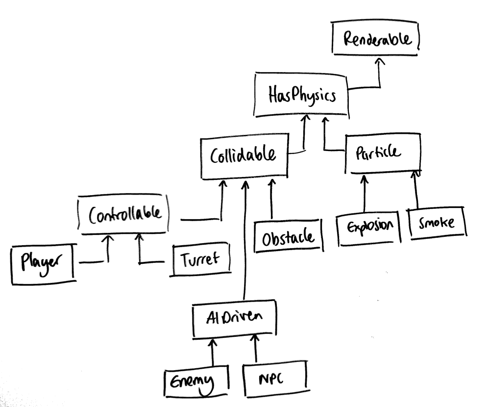
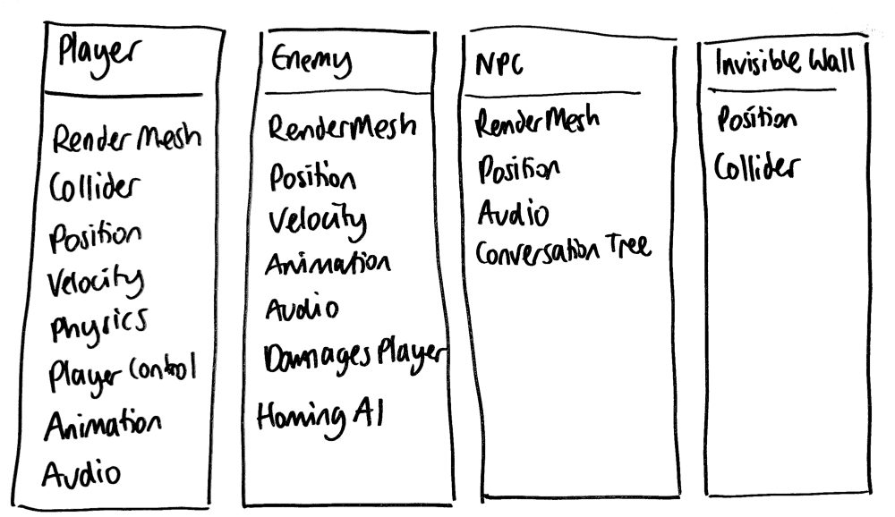
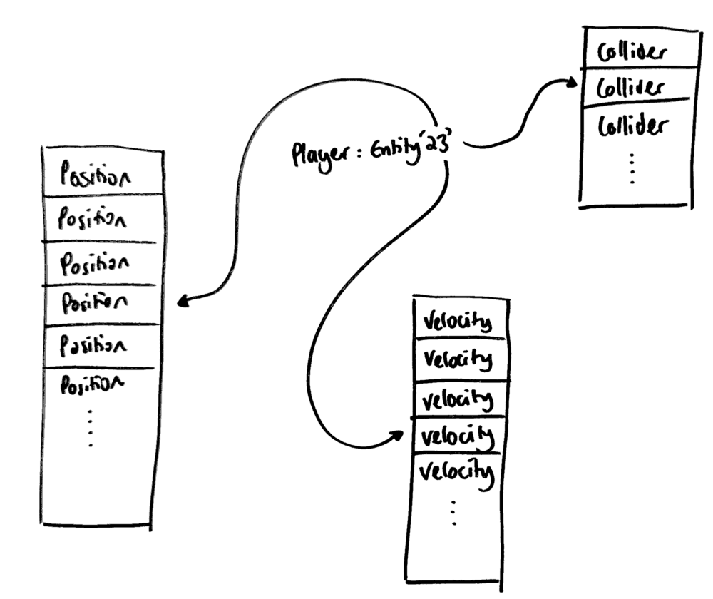
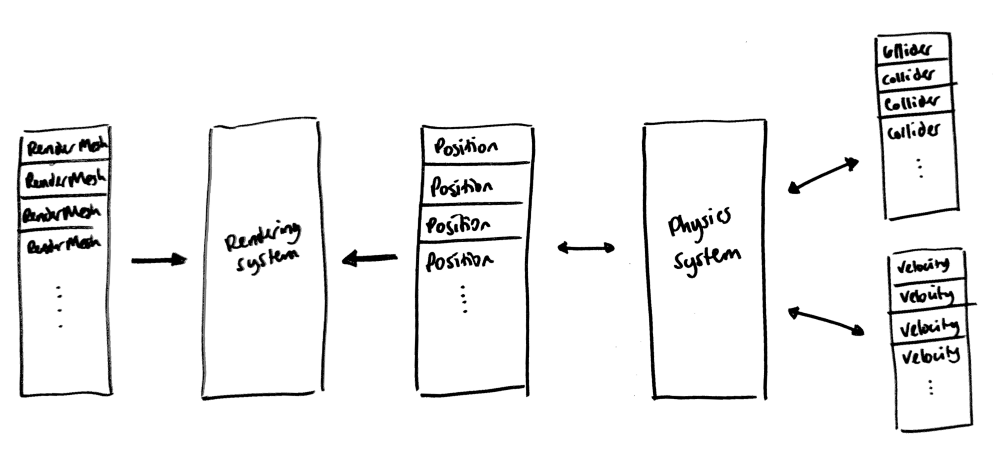

# nabla

## ECS

传统OOP架构是这样的

但是这样继承比如其中一个API改了(比如发现bug) 可能导致后面连锁反应，还有问题是比如一个障碍物如果你希望能控制的话会导致一个物体同时继承Controllable 和 Obstable -- 钻石继承

所以我们需要随时能添加属性的架构，

比如：

ECS (Entity Component System) 架构是这样的

- Entity: 就是一个id
- Component (属性): 只是一个struct， 比如位移，比如材质属性
- System: 每一系统拥有Component， 他能把Entity 翻译成正确的Component ， 并且更新之

有些Component 可能需要跨系统共享，比如位置信息，而有的Component 可能是私有的，比如速度，加速度。

比如位置信息可能每一个Entity都有,而加速度不是这样，所以我们处理位置信息可以直接把Entity 当作  Component 的数组下标，可以快速访问，加速度用map可能更加节省内存(如果很多物体没有这个属性)。

比如下图就是一个简单的System, Location 和 Movement 都是Component

比如渲染系统拥有  Transform Component， 那么动画系统可以在拥有关键帧 Component, 根据时间和关键帧插值，更新Transform Component， 然后渲染系统负责把 Transform Component 提交给渲染后端。而物理系统也可以检查碰撞更改物体移动。

建议读一下 <https://zhuanlan.zhihu.com/p/41652478> ， <https://medium.com/ingeniouslysimple/entities-components-and-systems-89c31464240d>讲的挺好的